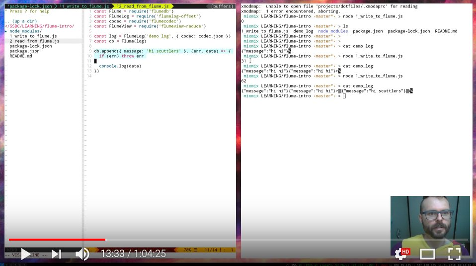

# Intro to Flume DB

An introduction to flumeDb - the database under secure scuttlebutt. Also, mix is a dragon onsie

Learn about the basics of Flume, and how to make a materialised view with it.

check out a wide range of scuttlebutt learning resources here : 
https://github.com/ssbc/scuttlebutt-guide

## Video

Recording of the stream: https://youtu.be/f_baWUW4R8Y

## TODO

I've yet to write up some links and resouces. Come back for those later

## PREP

- check out the `dry_run` branch and have a read of the code ahead of time if you like
- brush up on the basic use of `pull-stream`

resources: 
- https://github.com/ssbc/scuttlebutt-guide

